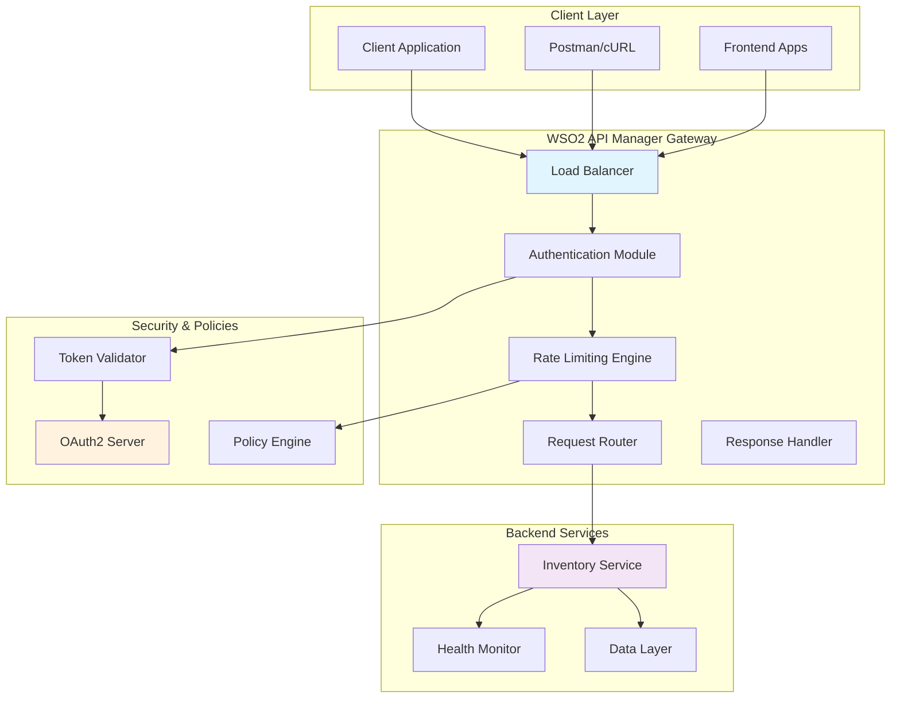
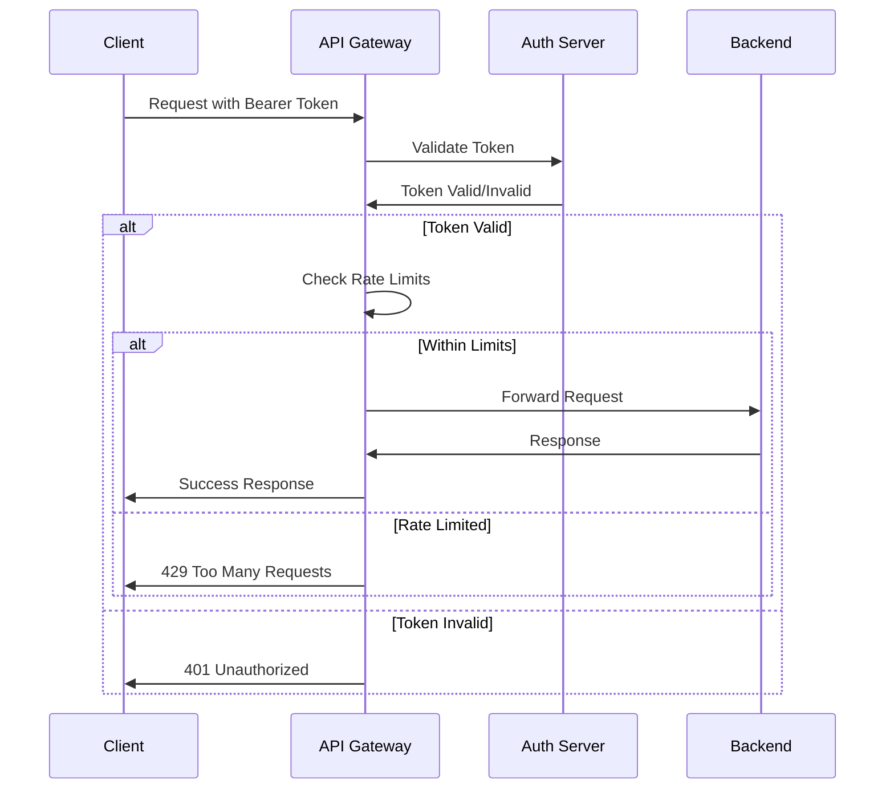

# System Architecture

## Overview

This document describes the architecture of the WSO2 API Manager Enterprise Demo, detailing component interactions, data flow, and design decisions.

## High-Level Architecture



## Component Details

### 1. API Gateway Layer (WSO2 APIM)

**Responsibilities:**
- Request authentication and authorization
- Rate limiting and throttling
- Request/response transformation
- Monitoring and analytics
- SSL termination

**Configuration:**
- **Host**: localhost:8243
- **SSL**: Enabled with self-signed certificates
- **Protocols**: HTTPS only
- **Timeout**: 30 seconds

**Key Features:**
- OAuth2 token validation
- Application-level rate limiting (50 req/min)
- CORS handling
- Request logging and metrics

### 2. Backend Service Layer

**Technology Stack:**
- **Runtime**: Node.js 18.x
- **Framework**: Express.js 4.18.x
- **Port**: 8081
- **Protocol**: HTTP (internal)

**Architecture Pattern:** MVC (Model-View-Controller)
```
├── server.js          # Application entry point
├── routes/            # API route definitions
├── middleware/        # Custom middleware
├── data/             # Data access layer
└── utils/            # Utility functions
```

**Service Capabilities:**
- RESTful API endpoints
- JSON data processing
- Error handling and validation
- Health monitoring
- Request logging

### 3. Security Architecture



**Security Layers:**
1. **Transport Security**: HTTPS encryption
2. **Authentication**: OAuth2 Bearer tokens
3. **Authorization**: Token scope validation
4. **Rate Limiting**: Application and subscription policies
5. **Input Validation**: Request sanitization

## Data Flow Architecture

### 1. Authentication Flow
```
Client Request → Gateway → Token Validation → Policy Check → Backend Forward
```

### 2. Rate Limiting Flow
```
Request → Rate Counter → Policy Engine → Allow/Deny Decision
```

### 3. Error Handling Flow
```
Error → Error Handler → Response Formatter → Client Response
```

## Performance Characteristics

### Latency Breakdown
| Component | Average Latency | Purpose |
|-----------|----------------|---------|
| SSL Handshake | 50ms | Transport security |
| Token Validation | 10ms | Authentication |
| Rate Limit Check | 5ms | Policy enforcement |
| Request Routing | 15ms | Gateway processing |
| Backend Processing | 200ms | Business logic |
| **Total** | **280ms** | End-to-end |

### Throughput Metrics
- **Maximum**: 50 requests/minute (application policy)
- **Sustained**: 45 requests/minute (recommended)
- **Burst**: 60 requests/minute (temporary)

### Resource Utilization
- **Memory**: 256MB (gateway) + 64MB (backend)
- **CPU**: <5% (normal load)
- **Network**: <1MB/s (typical usage)

## Scalability Considerations

### Horizontal Scaling
- **Gateway**: Multiple APIM instances behind load balancer
- **Backend**: Multiple service instances
- **Database**: Sharding and replication

### Vertical Scaling
- **Memory**: 8GB recommended for production
- **CPU**: 4+ cores for concurrent processing
- **Storage**: SSD for better I/O performance

## Security Architecture

### Defense in Depth
1. **Network**: Firewall and VPN access
2. **Transport**: TLS 1.3 encryption
3. **Application**: OAuth2 authentication
4. **Data**: Input validation and sanitization

### Token Management
- **Generation**: WSO2 Identity Server
- **Validation**: JWT signature verification
- **Expiration**: 3600 seconds (1 hour)
- **Refresh**: Manual regeneration required

## Monitoring and Observability

### Metrics Collection
- **Request Count**: Total API calls
- **Response Time**: Latency percentiles
- **Error Rate**: 4xx and 5xx responses
- **Rate Limit Hits**: Throttling events

### Health Checks
- **Gateway**: `/health` endpoint monitoring
- **Backend**: Service availability checks
- **Database**: Connection pool status

## Deployment Architecture

### Local Development
```
Developer Machine
├── WSO2 APIM (Docker)
├── Backend Service (Node.js)
└── Testing Tools (cURL/Postman)
```

### Production Recommendations
```
Production Environment
├── Load Balancer
├── APIM Cluster (3 nodes)
├── Backend Service Pool
├── Database Cluster
└── Monitoring Stack
```

## Technology Decisions

### Why WSO2 API Manager?
- **Enterprise Features**: Rate limiting, analytics, monetization
- **Standards Compliance**: OAuth2, OpenAPI, REST
- **Scalability**: Clustering and load balancing support
- **Community**: Active development and support

### Why Node.js Backend?
- **Performance**: Non-blocking I/O for high concurrency
- **Ecosystem**: Rich npm package ecosystem
- **Development Speed**: Rapid prototyping and iteration
- **JSON Native**: Perfect for REST API development

### Why OAuth2?
- **Industry Standard**: Widely adopted authentication protocol
- **Security**: Token-based authentication with expiration
- **Scalability**: Stateless authentication
- **Flexibility**: Multiple grant types support

## Future Enhancements

### Short Term
- [ ] Add database persistence (PostgreSQL/MongoDB)
- [ ] Implement comprehensive logging (ELK stack)
- [ ] Add unit and integration tests
- [ ] Create Docker Compose setup

### Long Term
- [ ] Microservices architecture
- [ ] Kubernetes deployment
- [ ] Advanced analytics and monitoring
- [ ] CI/CD pipeline integration

## Troubleshooting Architecture

### Common Issues
1. **Token Expiration**: 401 errors after 1 hour
2. **Rate Limiting**: 429 errors when exceeding 50 req/min
3. **SSL Issues**: Certificate validation in development
4. **Service Discovery**: Backend connectivity problems

### Debug Tools
- WSO2 APIM logs: `repository/logs/`
- Backend logs: Console output
- Network debugging: Browser dev tools
- API testing: Postman/cURL verbose mode

---

*Last Updated: 2025-11-16*  
*Version: 1.0*  
*Author: Pasindu Suraweera*