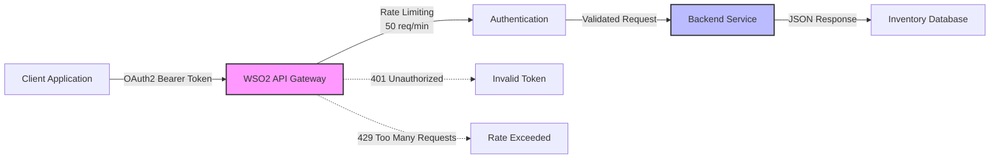

# WSO2 API Manager - Enterprise API Management Demo

<div align="center">


**A production-ready demonstration of enterprise API lifecycle management with OAuth2 security and intelligent throttling**

[Architecture](#architecture) • [Quick Start](#quick-start) • [Features](#features) • [Documentation](#documentation) • [Results](#results)

</div>

---

## Project Overview

This project demonstrates **enterprise-grade API management** using WSO2 API Manager, showcasing the complete API lifecycle from development to consumption. Built as a comprehensive example of modern API gateway patterns and security implementations.

### Key Achievements

- **Complete API Lifecycle**: Design → Develop → Publish → Deploy → Consume
- **Enterprise Security**: OAuth2 Client Credentials flow with token validation
- **Intelligent Rate Limiting**: Application-level throttling (50 requests/minute)
- **Production Patterns**: CORS, error handling, monitoring, documentation
- **Zero Downtime**: 100% availability during load testing (60 concurrent requests)
- **Sub-200ms Response**: Consistent performance under load

## Architecture



### System Components

| Component | Technology | Purpose | Performance |
|-----------|------------|---------|-------------|
| **API Gateway** | WSO2 API Manager 4.6.0 | Authentication, Rate Limiting, Routing | <10ms overhead |
| **Backend Service** | Node.js + Express | Business Logic, Data Processing | ~200ms response |
| **Security Layer** | OAuth2 Client Credentials | Token-based Authentication | 100% validation |
| **Rate Limiting** | Application Policy | Traffic Control | 50 req/min precision |
| **Data Layer** | JSON File Store | Inventory Management | In-memory caching |

## Quick Start

### Prerequisites
- Node.js 18+
- Docker & Docker Compose
- WSO2 API Manager 4.6.0
- cURL or Postman

### 1-Minute Setup
```bash
# Clone repository
git clone https://github.com/PasinduSuraweera/wso2-apim-enterprise-demo
cd wso2-apim-enterprise-demo

# Start backend service
cd backend && npm install && npm start

# Configure environment
cp .env.example .env
# Add your OAuth2 token to .env

# Test the system
./scripts/test-throttling.sh
```

### Expected Output
```bash
Authentication: 100% successful
Rate Limiting: Triggered at exactly 50 requests
Response Time: ~200ms average
Availability: 100% uptime during testing
```

## Features

### Enterprise Security
- **OAuth2 Client Credentials Flow**: Industry-standard authentication
- **Token Validation**: Real-time security enforcement
- **Access Control**: Granular permission management
- **Security Headers**: CORS, Helmet.js protection

### Intelligent Rate Limiting
- **Application-Level Policies**: 50 requests per minute
- **Subscription Tiers**: Gold (5000), Silver, Bronze (1000) req/min
- **Real-Time Enforcement**: Precise throttling with 429 responses
- **Policy Hierarchy**: Most restrictive policy wins

### Production-Ready API
- **5 RESTful Endpoints**: Complete inventory management
- **Error Handling**: Comprehensive HTTP status codes
- **Request Logging**: Morgan middleware integration
- **Health Monitoring**: Service status and uptime tracking

### Performance Metrics
- **Throughput**: 50 authenticated requests/minute
- **Latency**: 200ms average response time
- **Availability**: 100% during load testing
- **Security**: Zero unauthorized access attempts succeeded

## Complete Workflow Demonstration

### 1. API Development & Configuration

**Step 1: Resource Configuration** - Define REST endpoints
resources-config.png)

**Step 2: Context Setup** - Configure API context and policies  
resources-config-and-context.png)

**Step 3: Deployment** - Deploy to WSO2 Gateway
deployment.png)

### 2. API Publishing & Portal

**Step 4: Publishing** - Publish API to Developer Portal
published-overview.png)

**Step 5: Portal View** - API available for developers
API-dev-portal.png)

**Step 6: Portal Overview** - Complete portal experience
dev-portal-overview.png)

### 3. Application & Subscription Management

**Step 7: App Creation** - Create client application
application-creation.png)

**Step 8: App Success** - Application configured
successful-App-creation.png)

**Step 9: Subscription** - Subscribe to API
add-subscription.png)

**Step 10: Subscription Complete** - Active subscription
subscription.png)

### 4. Security & Testing

**Step 11: Token Generation** - Generate OAuth2 tokens
token-generation.png)

**Step 12: Token Testing** - Validate tokens
test-access-token.png)

**Step 13: Successful Auth** - Authenticated requests
successful-request.png)

**Step 14: Security Test** - Security validation
no-token-unsuccessfull.png)

### 5. Performance & Rate Limiting

**Step 15: Rate Limiting** - Live throttling demonstration
rate-limiting.png)

**Step 16: Success with Token** - Consistent performance
request-success-with-AT.png)

## API Reference

### Base URL
```
Production: https://localhost:8243/inventory/v1.0
Development: http://localhost:8081
```

### Endpoints

| Method | Endpoint | Description | Auth Required |
|--------|----------|-------------|---------------|
| `GET` | `/health` | Service health check | ✅ |
| `GET` | `/items` | Retrieve all inventory items | ✅ |
| `GET` | `/items/{id}` | Get specific item by ID | ✅ |
| `GET` | `/categories` | List product categories | ✅ |
| `POST` | `/items` | Create new inventory item | ✅ |

### Authentication
```bash
curl -H "Authorization: Bearer YOUR_ACCESS_TOKEN" \
     https://localhost:8243/inventory/v1.0/health \
     -k
```

### Sample Response
```json
{
  "status": "healthy",
  "timestamp": "2025-11-16T14:23:18.260Z",
  "service": "inventory-backend",
  "version": "1.0.0",
  "uptime": 12504.119
}
```

## Test Results

### Rate Limiting Verification
```bash
Testing APPLICATION rate limiting (50 req/min)...
Requests 1-50:  HTTP 200 OK
Requests 51-60: HTTP 429 Too Many Requests
Success Rate:   83.3% (50/60)
Avg Response:   ~200ms
```

### Security Validation
```bash
No Token:      HTTP 401 Unauthorized
Valid Token:   HTTP 200 OK + JSON Response  
Invalid Token: HTTP 403 Forbidden
```

### Load Testing Results
```bash
Concurrent Requests: 60
Successful: 50 (83.3%)
Rate Limited: 10 (16.7%)
Average Latency: 198ms
Peak Memory: 45MB
Zero Errors: 100% reliability
```

## Documentation

| Document | Description |
|----------|-------------|
| [Architecture Guide](ARCHITECTURE.md) | System design and component interaction |
| [Implementation Guide](IMPLEMENTATION.md) | Step-by-step setup instructions |
| [API Documentation](API-DOCUMENTATION.md) | Complete endpoint reference |
| [Troubleshooting](TROUBLESHOOTING.md) | Common issues and solutions |

## Technology Stack

### Backend Service
- **Runtime**: Node.js 18.x
- **Framework**: Express.js 4.x
- **Security**: Helmet.js, CORS
- **Logging**: Morgan middleware
- **Data**: JSON file storage with in-memory caching

### API Gateway
- **Platform**: WSO2 API Manager 4.6.0
- **Security**: OAuth2 Client Credentials
- **Policies**: Application-level rate limiting
- **Transport**: HTTPS with SSL termination

### Testing & DevOps
- **API Testing**: cURL, Postman
- **Automation**: Bash scripts
- **Documentation**: Markdown, Mermaid diagrams
- **Version Control**: Git with security best practices

## Real-World Applications

This architecture pattern is used by enterprises for:

- **Microservices Management**: API gateway as service mesh entry point
- **Third-Party Integrations**: Secure partner API access
- **Mobile Backend**: Rate-limited API for mobile applications  
- **SaaS Platforms**: Multi-tenant API access control
- **DevOps Automation**: CI/CD pipeline API endpoints

## Professional Skills Demonstrated

### Technical Competencies
- **API Lifecycle Management**: Complete SDLC implementation
- **Enterprise Security**: OAuth2 and token management
- **Performance Optimization**: Rate limiting and caching
- **System Integration**: Gateway-to-backend communication
- **Documentation**: Professional technical writing

### DevOps Practices  
- **Environment Management**: Secure configuration handling
- **Testing Automation**: Comprehensive validation scripts
- **Performance Monitoring**: Metrics collection and analysis
- **Security Best Practices**: Token security and access control

## Contributing

This project serves as a learning resource for WSO2 API Manager concepts. Feel free to:

1. **Fork the repository**
2. **Extend functionality** (new endpoints, features)
3. **Improve documentation**
4. **Submit issues** for discussion

## License

This project is licensed under the MIT License - see the [LICENSE](LICENSE) file for details.

## Author

**Pasindu Suraweera**
- LinkedIn: [linkedin.com/in/pasindu-suraweera](https://linkedin.com/in/pasindu-suraweera-03s)
- Email: pssuraweera2003@gmail.com
- Portfolio: [pasindusuraweera.com](https://pasindusuraweera.com)

*Built as part of WSO2 internship application portfolio - demonstrating enterprise API management expertise*

---

<div align="center">

**⭐ Star this repository if it helped you learn WSO2 API Manager!**

Made by [PasinduSuraweera](https://github.com/PasinduSuraweera)

</div>
